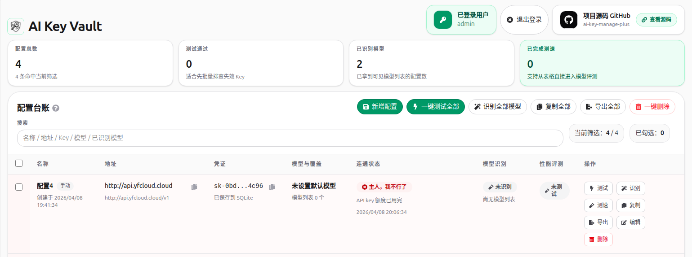

# AI Key Vault

一个更适合自己长期用的 AI API Key 管理小工具。

它不是那种花里胡哨的大平台，核心思路就一件事: 把手上的 Key、地址、模型先收整齐，再用最省事的方式判断它现在到底还能不能用、能看到哪些模型、哪个模型更适合拿来当默认模型。

如果你手里经常有多套 OpenAI 兼容渠道，或者总在不同平台之间来回复制 Key，这个项目基本就是为这种场景准备的。


# 效果




## 现在已经支持什么

### 🔐 配置管理

- 配置默认保存到服务器本地 `SQLite` 数据库，多个浏览器登录后都能访问同一份数据
- 自动兼容旧版本浏览器本地数据，数据库为空时会尝试把旧 `localStorage` 配置迁移进去
- 支持复制单条配置，也支持复制全部配置
- 支持导出 `.txt` 和 `.md`

### 📥 导入解析

- 支持粘贴解析，能识别 `curl`、JSON、环境变量风格文本、结构化文本块、`ccswitch://` 链接
- 支持一次粘贴多个配置，解析后可批量直接新增
- 支持把解析结果先回填到表单，再决定要不要保存

### ✅ 可用性测试

- 支持单条测试，也支持一键测试全部配置
- 测试结果会记录状态、错误详情、最近测试时间
- 适合先快速判断某个 Key 和地址现在还能不能打通

### 🧠 模型识别

- 支持读取当前 Key 在该渠道下能看到的模型列表
- 识别完成后会给出推荐模型，并支持复制模型列表
- 支持在识别结果里直接切换当前模型
- 复制单条配置或复制全部配置时，会把模型识别得到的模型列表一起带上

### ⚡ 性能评测

- 支持按模型做 1 到 3 轮测速
- 会展示平均耗时、中位耗时、首字时间、成功率、稳定性
- 支持按模型名或 tag 搜索模型，方便从长列表里筛选
- 会自动汇总最快模型、首字最快模型、最稳模型，并给出一个默认推荐模型
- 会自动跳过明显不适合做对话测速的模型，比如 embedding、rerank、部分图像类模型

### 🔗 CC Switch 联动

- 支持导出到 CC Switch，也支持直接唤起 CC Switch 导入
- 当前已适配的目标 App 包括 `Claude`、`Codex`、`Gemini`、`OpenCode`、`OpenClaw`

## 这个项目适合谁

- 手上有多套 AI API Key，想统一收纳的人
- 经常会忘记某个渠道地址、模型名、Key 放哪了的人
- 想快速判断某个 Key 还能不能打通的人
- 想先识别模型，再挑一个更稳、更快默认模型的人
- 想要一个轻量、自己部署、自己掌控数据的小工具的人

## 隐私和数据说明

这个项目默认把配置数据保存在部署机器本地的 `SQLite` 数据库里，不接第三方数据库，也不会帮你托管 Key。

但有一点要说明白: 连通性测试、模型识别、性能评测这类真实联网请求，还是会经过项目自己的同源后端接口转发。这样做主要是为了绕开浏览器直连上游时常见的 CORS 问题。

简单理解就是:

- 配置数据默认存在你部署机器本地的 `SQLite` 文件里
- 项目没有接外部数据库
- 真正发请求测试时，Key 会参与当前这次后端转发请求

## 登录说明

- 已内置用户名密码验证码登录
- 仓库里不再内置任何默认用户名和默认密码
- 首次部署时必须由你自己设置 `DEFAULT_USERNAME`、`DEFAULT_PASSWORD`、`AUTH_SECRET`
- 推荐直接使用交互式脚本生成本地未追踪的环境文件

## 快速开始

先准备运行环境变量：

```bash
bash scripts/setup-env.sh
```

这个脚本会让你自己输入登录用户名和密码，并生成本地使用的 `.env.local` 与 Docker 使用的 `.env.docker.local`。

然后再启动：

```bash
npm install
npm run dev
```

打开 [http://localhost:3000](http://localhost:3000) 就能开始用。

首次启动后，如果数据库里还没有用户，系统会根据你设置的环境变量创建首个登录用户。

## 环境变量

可以参考 `.env.example`：

```bash
AUTH_SECRET=
DATABASE_PATH=./data/ai-key-vault.db
DEFAULT_USERNAME=
DEFAULT_PASSWORD=
```

如果你是手动本地运行，可以直接填写 `DEFAULT_USERNAME` 和 `DEFAULT_PASSWORD`。

如果你走 `bash scripts/setup-env.sh` 或 `bash scripts/docker-compose-up.sh`，脚本会自动生成 `.env.local` 和 `.env.docker.local`，其中用户名和密码会写成 `DEFAULT_USERNAME_B64` / `DEFAULT_PASSWORD_B64`，避免因为特殊字符导致 `.env` 解析出错。

## 打包部署

```bash
npm run build
npm run start
```

部署到支持 Next.js 的平台也没问题，比如 Vercel、Netlify 等。

## Docker Compose 部署

```bash
bash scripts/docker-compose-up.sh
```

这个脚本会：

- 检查 `.env.docker.local` 是否存在
- 如果不存在，则先提示你输入用户名、密码和 `AUTH_SECRET`
- 再把这些值通过 `--env-file` 传给 `docker compose`

部署后的默认行为：

- 服务监听 `3000`
- SQLite 数据库挂载到 Docker volume `ai-key-vault-data`
- 没有仓库内置默认账号密码，必须自行设置

如果你想重新生成一套凭据，可以执行：

```bash
bash scripts/docker-compose-up.sh --reconfigure
```

如果你之前已经用旧版本启动过，并且数据库里已经存在历史默认账号，想彻底移除旧账号，需要删除旧的 SQLite 数据文件或 Docker volume 后重新初始化。

## 重置登录账号

登录账号保存在 SQLite 的 `users` 表里，不是每次启动都会被环境变量覆盖。

当前逻辑是：

- 只有当 `users` 表为空时，系统才会用当前环境变量创建首个登录用户
- 如果你后来改了 `.env.local` 或 `.env.docker.local`，数据库里的旧账号不会自动被替换

所以如果你已经改了账号密码，但仍然登录失败，最简单的方式不是手工找库删数据，而是直接执行重置脚本：

本地运行时：

```bash
bash scripts/reset-auth.sh --local
```

Docker Compose 部署时：

```bash
bash scripts/reset-auth.sh --docker
```

这个脚本会：

- 清空 `users` 表
- 按当前 `.env.local` 或 `.env.docker.local` 里的用户名和密码重建登录账号
- 不会删除你已经保存的配置数据

如果你要连配置一起彻底清空：

本地运行时：

```bash
rm -f data/ai-key-vault.db
```

Docker Compose 部署时：

```bash
docker compose --env-file .env.docker.local down -v
```

注意：

- `docker-compose.yml` 默认把数据库挂载到 Docker volume `ai-key-vault-data`
- 所以 Docker 部署下，数据库通常不在宿主机的 `data/ai-key-vault.db`
- 你直接执行 `sqlite3 data/ai-key-vault.db`，很可能删到的是一个不存在的本地路径

## 使用方式很简单

1. 填一条配置，或者直接把现成的 `curl` / JSON / 文本块粘进来
2. 点“保存配置”或者“粘贴并直接新增”
3. 先做连通性测试，确认地址和 Key 没问题
4. 再做模型识别，看看这个渠道到底开放了哪些模型
5. 如果模型很多，就打开性能评测，跑几轮后挑一个更适合日常使用的默认模型

## 技术栈

- Next.js 16
- React 19
- TypeScript
- Tailwind CSS 4
- ECharts

